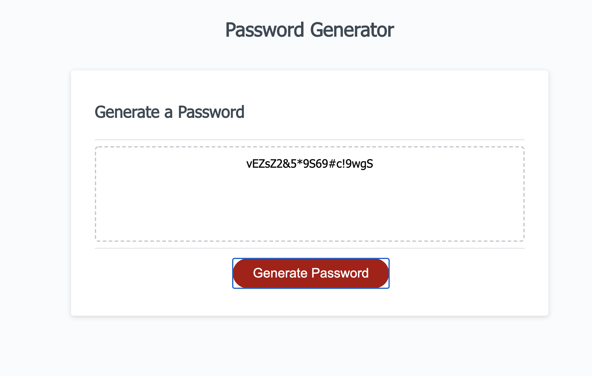

# homework3.2

plan the code: 

Goal: I need a new, secure password

WHEN I click the button to generate a password
THEN I am presented with a series of prompts for password criteria

    ==> alert("A secure password should contain special charactor, upper case letter, lower case letter, and at least 8");

WHEN prompted for password criteria
THEN I select which criteria to include in the password
==>   var allTogether = [];
             if (confirm("Would you like upper case?")){
              allTogether= allTogether.concat(UpperCase);
             }
            
             if (confirm("Would you like to havve lower case?")){
              allTogether= allTogether.concat(LowerCase);
           }
          
            if (confirm("Would you like to have special charactor?")){
              allTogether= allTogether.concat(charactors);
            }
            if (confirm("Would you like to have numbers?")){
              allTogether= allTogether.concat(numbers);
            }
           // alert(allTogether);

WHEN prompted for the length of the password
THEN I choose a length of at least 8 characters and no more than 128 characters
     // checking  the length of the password 
            if ( passowrdLength1 <8 ){
                confirm("choose a number greater than 8 for the length of your password");
                 passowrdLength1 = prompt("Choose a number that is equal to or greater than 8");
            }
            
            if(passowrdLength1>128){
            /* window.*/confirm("choose a number less than 128");
                passowrdLength1 = prompt("Choose a number less than 128 but greater than 8");
                
            }

WHEN prompted for character types to include in the password
THEN I choose lowercase, uppercase, numeric, and/or special characters
WHEN I answer each prompt
     var allTogether = [];
             if (confirm("Would you like upper case?")){
              allTogether= allTogether.concat(UpperCase);
             }
            
             if (confirm("Would you like to havve lower case?")){
              allTogether= allTogether.concat(LowerCase);
           }
          
            if (confirm("Would you like to have special charactor?")){
              allTogether= allTogether.concat(charactors);
            }
            if (confirm("Would you like to have numbers?")){
              allTogether= allTogether.concat(numbers);
            }
THEN my input should be validated and at least one character type should be selected
       // this two math.random lines willl select elements from alltogether-array
          var letterArray = Math.floor(Math.random()*allTogether.length);
          var charArray = Math.floor(Math.random()*allTogether[letterArray].length);
       
        // this put the randomly selected elements together
        var passwordChar = allTogether[letterArray][charArray];

WHEN all prompts are answered
THEN a password is generated that matches the selected criteria
[yes]
WHEN the password is generated
THEN the password is either displayed in an alert or written to the page
(refer to generatedpassword.png)

